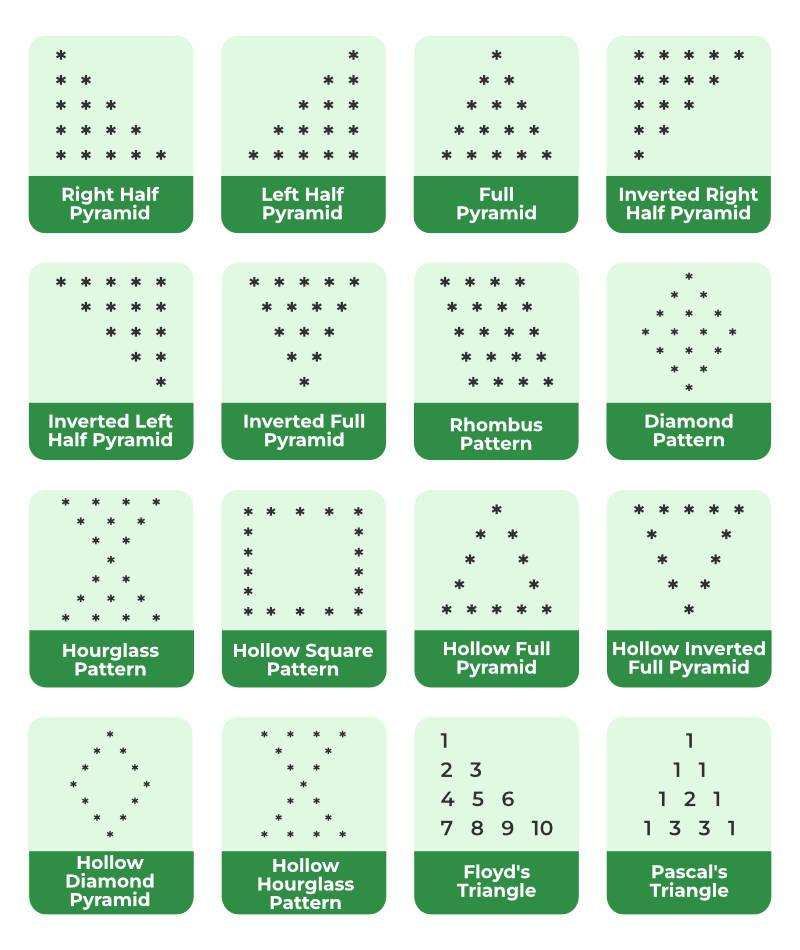

# DSA-ZERO-TO-HERO

Welcome to **DSA-ZERO-TO-HERO**, your comprehensive guide to mastering Data Structures and Algorithms (DSA)! This repository is designed to guide learners through a structured journey from the basics to advanced topics, ensuring a smooth and progressive learning curve.

## Description

This repository is your one-stop destination for diving deep into the world of DSA. Whether you are a beginner or looking to refresh your knowledge, this guide offers a structured path to mastering DSA.

### What you'll find here:

- **Structured learning:** Each day is dedicated to specific topics, offering a clear and focused learning path.

- **Day-by-day breakdown:**
  - **Day 1:** Explore patterns and foundational programming concepts.
      
  - **Day 2:** Tackle your first set of programming problems to solidify your understanding.
    - **Problems:**
      - [Write a C Program to Check Whether a Number is Prime or Not](DAY%20-%202/LOOPS/1.Program%20to%20Check%20Prime%20Number.c)
      - [Write a C Program to Print the ASCII Value of a Character](DAY%20-%202/LOOPS/2.Program%20to%20Print%20ASCII%20Value.c)
      - [Write a C program to read an integer and print its multiplication table](DAY%20-%202/LOOPS/3.Multiplication%20Table%20Up%20to%20a%20range.c)
      - [Write a C program to print all leap years from 1 to N](DAY%20-%202/LOOPS/4.Leap%20year%20program%20in%20C.c)
      - [Write a C program to print all upper case and lower case alphabets](DAY%20-%202/LOOPS/5.Program%20to%20display%20all%20alphabets%20from%20A%20to%20Z.c)
- **Day 3:** Tackle your Second set of programming problems to solidify your understanding.
    - **Problems:**
      - [Write a Program in C to Swap the values of two variables without using any extra variable.](DAY%20-%203/1.Write%20a%20Program%20in%20C%20to%20Swap%20the%20values%20of%20two%20variables%20without%20using%20any%20extra%20variable.c)
      - [Write a Program to Replace all 0’s with 1’s in a Number](DAY%20-%203/Replace_zeros_with_ones.java)
      - [Write a Program to convert the binary number into a decimal number](DAY%20-%203/Program%20to%20Convert%20Binary%20Number%20to%20Decimal.c)
      - [Write a program to Factorial of a Number](DAY%20-%203/Write%20a%20program%20to%20Factorial%20of%20a%20Number.c)
      - [Write a Program to reverse a number](DAY%20-%203/Write%20a%20Program%20to%20reverse%20a%20number.c)

  *(Further days will be added as I progress in my learning journey.)*

- **Progressive difficulty:** The complexity of topics gradually increases, ensuring a well-paced learning journey.

- **Continuous learning:** This repository lays down a solid foundation for DSA, serving as a springboard for further exploration and practice.

## Getting Started

### Clone the repository:

To clone the repository and start your learning journey, run the following command in your terminal:

```bash
git clone https://github.com/Priyadharshan2003/DSA-ZERO-TO-HERO.git
